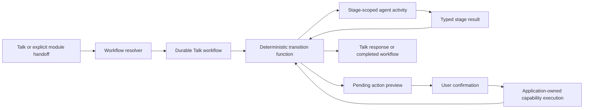
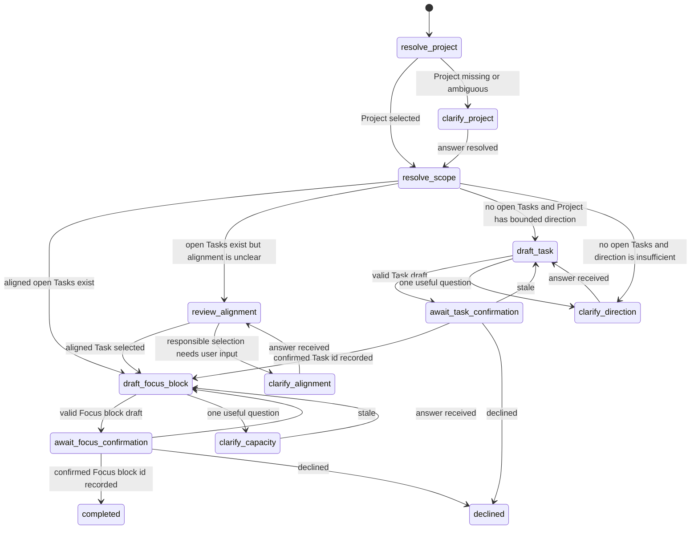

# Phase 6 Talk workflow separation and extensibility plan

**Date:** 2026-08-04  
**Status:** Proposed architecture and delivery plan  
**Depends on:** Phase 5 and ADR-0008  
**Scope:** Phase 6 Talk orchestration; no product writes or runtime changes are performed by this plan

## Goal

Make Talk extensible across the closed Phase 6 workflow set without turning it
into one giant prompt or letting the model decide legal workflow transitions.

The target architecture is:

> **One visible Talk surface, application-owned durable workflows, explicit
> domain stages, and one bounded agent activity per stage.**

This plan preserves the Phase 5 safety work: the application owns workflow
state, confirmation, idempotency, validation, and writes. The OpenAI Agents SDK
continues to run bounded model/tool loops, but an SDK run is an activity inside
one workflow stage, not the workflow engine.

## Problem established by the Phase 6 tracer

The failed Work → Talk run used this tool sequence:

1. `list_work_projects`
2. `get_work_scope`
3. `validate_daily_plan`
4. `validate_daily_plan`
5. `validate_daily_plan`
6. `validate_daily_plan`
7. `validate_daily_plan`
8. `validate_daily_plan`

All eight tool calls succeeded, but the model never returned a structured
decision. The failure was not caused by invalid time-zone data or an
`indeterminate` Daily Plan result.

The runtime currently asks one agent to choose between two materially different
contracts:

- propose a new Task when the Project has no open Tasks; or
- plan and validate a Focus block from existing Tasks.

At the same time, stronger legacy instructions still require the agent to plan
exactly one Focus block and not substitute an ordinary Task. The single agent,
combined output schema, combined instruction packs, and six-tool allowlist make
the model the effective workflow router. `maxTurns` only limits how long that
ambiguous route can run.

The deterministic tests proved that the application can process an injected
`task_proposal`; they did not prove that the real model selects that branch from
the combined prompt.

## Architectural decision

Use a lightweight, application-owned hierarchical state machine for Talk.

- The outer state is the active **Talk workflow**.
- The inner state is the workflow's current **stage**.
- Application code loads authoritative records and selects legal transitions.
- A stage may invoke one narrowly scoped agent activity.
- The activity receives only the context, instructions, tools, and structured
  output contract needed for that stage.
- Agent output becomes a typed event that the application may accept or reject;
  it does not directly select an arbitrary next stage.
- A pending write pauses the workflow in an explicit confirmation stage.
- Confirmation produces a typed application event and resumes the workflow
  without pretending that the user sent another natural-language message.

This is a state-machine pattern, not a general graph engine. HealthyFlow does
not need XState, Temporal, LangGraph, or the static DAG executor from the
`agents` repository for Phase 6. Those systems validate the separation between
deterministic orchestration and nondeterministic activities, but adding one as a
dependency would not reduce the current product complexity.

## Architecture boundaries

### Workflow, stage, and capability are different things

| Concept | HealthyFlow example | Responsibility |
|---|---|---|
| Workflow | `plan_work` | Owns the durable user goal and legal sequence of stages |
| Stage | `draft_task` | Performs one bounded reasoning or application step |
| Capability | `add_work_task` | Executes one validated, confirmed, idempotent product write |

Creating a Task is therefore not a separate Talk workflow. It is a reusable
capability invoked after the `plan_work` workflow reaches Task confirmation.
The same capability may later be used by another workflow without sharing that
workflow's prompt, stages, or transition rules.

### `talk-workflow.ts`

This remains the deep orchestration module. It owns:

- workflow creation and resumption;
- the closed workflow and stage definitions;
- legal state transitions;
- authoritative context loading;
- compare-and-swap workflow claims;
- proposal validation and fingerprints;
- confirmation, decline, stale-state handling, and exactly-once recovery;
- translating stage results and capability results into workflow events;
- deciding whether to answer, wait, run another stage, or complete.

It must not contain OpenAI transport details or let a route handler assemble
workflow topology.

### `talk-agent-runtime.ts`

This remains the OpenAI adapter. It owns:

- mapping a selected stage profile into an Agents SDK `Agent` and `Runner`;
- stage-specific instructions;
- stage-specific tool allowlists;
- stage-specific Zod output schemas;
- stage-specific turn and token budgets;
- normalized usage, trace, and tool-event reporting;
- typed runtime failures that preserve the calls completed before failure.

It must not decide which Talk workflow or stage runs next.

### Capability modules

Modules remain the source of truth for their records and bounded capabilities.
The model never receives write capabilities. The workflow module prepares a
pending action, and confirmed application code executes the registered write
capability with ownership, validation, audit, and idempotency checks.

### Routes and frontend

Routes remain thin: validate, call the workflow module, return the result. The
frontend renders messages, clarification choices, and pending action previews.
It does not infer workflow transitions or fabricate hidden continuation
messages.

## Closed workflow registry

Phase 6 retains the closed workflow set from the design target:

- `plan_day`
- `plan_work`
- `run_focus_block`
- `review_focus_block`
- `replan_day`
- `log_outcome`
- `review_project`
- `quick_chat`

Each registered workflow defines:

1. its Zod-validated start input;
2. its stage enum and initial stage;
3. its Zod-validated durable state;
4. the events accepted by each stage;
5. a pure transition function for legal next stages;
6. the application activity or agent activity run by each executable stage;
7. its confirmation and terminal stages;
8. trace labels and version identifiers.

Adding a workflow should extend this registry and its tests. It must not require
changing the generic Agents SDK loop, pending-action machinery, routes, or Talk
UI protocol.

## Workflow selection mechanics

The workflow resolver uses this precedence:

1. **Explicit module handoff.** Work → Talk supplies `plan_work` and a structured
   `projectId`; a Focus block supplies its id to `run_focus_block` or
   `review_focus_block`.
2. **Active durable workflow.** If the conversation has an active workflow,
   resume its exact stage before classifying new intent.
3. **Deterministic product command.** Confirmation, decline, start, finish, and
   review actions are typed events, not free-text routing decisions.
4. **Bounded intent classification.** Only free-form Talk with no active workflow
   may select one value from the closed workflow set.
5. **`quick_chat` fallback.** A request that does not require a durable workflow
   remains a bounded conversational response.

Once selected, a workflow cannot be silently changed by the model. Changing or
abandoning an active workflow requires an explicit application transition.

## `plan_work` reference state machine

`plan_work` is the first migration because it contains the failure that exposed
the missing separation.

### Deterministic stages

`resolve_project` and `resolve_scope` are application activities, not agent tool
loops.

- A Work → Talk handoff already knows the Project and must pass its id as
  structured workflow input.
- The application verifies ownership and loads the bounded Work scope directly.
- Open Task count and recorded Task relationships are facts, so code branches on
  them.
- Project target, milestone, context summary, and next valuable step are passed
  as bounded structured context to the next stage.

`list_work_projects` is needed only when a free-form Talk request has not already
selected a Project. `get_work_scope` should not consume a model turn when the
workflow already owns a verified `projectId`.

### Task-drafting activity

The Task-drafting agent receives:

- one verified Project scope;
- the anchor date and timezone;
- the user's relevant clarification, if any;
- no Daily Plan tools;
- no Focus-block instructions;
- no write tool.

Its output contract is only:

- `task_draft`;
- `ask` one useful question; or
- `blocked` with concrete reason codes.

It cannot return a Focus block or call `validate_daily_plan`.

### Focus-planning activity

The Focus-planning agent receives:

- one verified Project;
- at least one verified, open, aligned Task id;
- the anchor date, timezone, current local time, and focus-time meaning;
- only the Daily Plan read/compute/validation tools needed to find a placement;
- no Task-drafting instructions;
- no write tool.

Its output contract is only:

- `focus_draft`;
- `ask` one useful question; or
- `blocked` with concrete reason codes.

The application rejects a Focus block unless it references the selected Project
and at least one verified Task, matches the anchor date, and passes authoritative
Daily Plan validation.

### Stage budgets

There is no global eight-turn budget for an entire product workflow. Each agent
activity has a small budget appropriate to its contract. Initial values must be
chosen from live evaluations of that stage, not by increasing the old global
limit. A zero-tool Task-drafting activity and a Daily Plan validation activity
should not share the same budget.

## Durable state and database evolution

The existing `talk_workflows` row and revision compare-and-swap mechanism remain
the durable base. Phase 6 must make it generic enough for more than one Work
workflow.

### Generic persisted fields

Retain or add:

- workflow id, user id, and conversation id;
- workflow name and workflow-definition version;
- current domain stage;
- anchor date and timezone;
- Zod-validated workflow state JSON;
- pending action id and confirmation state;
- proposal fingerprint when authoritative records can become stale;
- model, runtime version, and instruction versions;
- revision, last error, timestamps, and terminal status.

### Required migration changes

1. Expand the workflow-name constraint to the closed Phase 6 set.
2. Replace the generic Phase 5 stage constraint with workflow-specific stages
   validated by the application contract.
3. Add a generic `state` JSONB envelope and backfill the current Work fields.
4. Keep generic safety columns such as pending action, fingerprint,
   confirmation, revision, and error outside the JSON envelope.
5. Remove the single-row-per-conversation assumption. Preserve workflow history
   and enforce at most one active workflow per user and conversation with a
   partial unique index.
6. Backfill the existing `plan_focused_work` workflow as version 1 of
   `plan_work`, or support the old name only as an explicit compatibility alias
   during rollout.
7. Remove the old Work-specific columns only after backfill and read-path
   verification so there is never a dual source of truth.

Do not persist opaque Agents SDK `RunState` as product workflow state.

## Confirmation and continuation

Pending actions remain application-owned and exactly once.

1. A stage returns a typed draft.
2. The application re-reads authoritative records, validates the draft, creates
   a pending action, fingerprints its sources, and transitions to the matching
   confirmation stage.
3. The user confirms, edits, or declines the preview.
4. Confirmation atomically claims the pending action and revalidates ownership,
   source freshness, and arguments.
5. The registered capability performs the write with the pending action id as
   its idempotency key.
6. The capability result becomes a typed workflow event.
7. The transition function records created ids and advances to the next domain
   stage.

For the zero-Task flow, `task_confirmed { taskId, projectId }` transitions
directly to `draft_focus_block`. The workflow service continues from that stage;
the frontend must not send a synthetic hidden user message asking the model what
to do next.

Native Agents SDK approvals may remain an implementation option for isolated
tool approval, but they do not replace HealthyFlow's product workflow state,
source fingerprints, audit records, or exactly-once capability execution.

## Failure and observability contract

Every stage run must be diagnosable without enabling sensitive OpenAI trace
payloads.

- Persist workflow id, name, stage, definition version, runtime version,
  instruction versions, model, trace id, and usage.
- Record each completed tool event with tool name, sanitized arguments, result
  status, duration, and reason codes.
- If the SDK throws after tool calls, return a typed runtime error containing the
  accumulated tool events instead of discarding them.
- Distinguish runtime failures such as max turns or invalid structured output
  from expected product outcomes such as `ask`, `blocked`, `declined`, and
  `stale`.
- A max-turn error reports the stage and actual tool sequence.
- Trace names identify the workflow and stage, not only “Phase 6 Talk.”
- Stage retries never replay confirmed writes; pending-action idempotency remains
  authoritative.

## Extendability rules

A new workflow or stage is acceptable only when:

- its domain purpose is distinct and named with HealthyFlow vocabulary;
- its legal transitions can be enumerated;
- its durable state has one Zod schema;
- its model activity has one narrow output contract;
- its capability allowlist is minimal;
- all writes are previewed and confirmed;
- deterministic code owns dates, arithmetic, permissions, ownership, state
  transitions, and writes;
- it can be tested through its workflow interface with injected dependencies;
- adding it does not expand unrelated stage prompts or tool lists.

Use multiple agent definitions only when stages materially differ in
instructions, tool surface, output contract, model, or approval policy. Do not
use handoffs merely to move from one stage of a workflow to another. A manager
agent may be considered later for bounded cross-module synthesis, but it must
not own durable workflow transitions.

Static DAG execution may be introduced later inside a stage that genuinely
benefits from parallel independent activities. It is not the outer Talk
workflow model and is not needed for `plan_work`.

### Deliberate non-goals for Phase 6

- no general graph engine or dynamically authored workflows;
- no manager agent that chooses product transitions;
- no nested workflow rows until independent child resumption is demonstrated;
- no migration of all workflows before the `plan_work` vertical slice is proven;
- no replacement of the existing capability, pending-action, or compare-and-swap
  safety mechanisms.

## Disposition of the current uncommitted Phase 6 slice

The useful pieces can remain candidates for the implementation:

- `add_work_task` capability registration and confirmation handling;
- Task preview UI support;
- pending-action invalidation for Task writes;
- deterministic workflow tests for stale, decline, and exactly-once behavior.

The following shape must be replaced before the slice is considered complete:

- one union decision schema containing both Task and Focus proposals;
- Task and Focus instructions loaded into the same agent run;
- Work and Daily Plan tools exposed together for every stage;
- generic stages such as `clarifying` that do not identify what is being
  clarified;
- tests that inject the desired branch without evaluating actual stage
  selection;
- frontend-driven hidden-message continuation after Task confirmation.

No current uncommitted file should be discarded wholesale. Preserve the safe
capability and UI work while moving branch selection into the workflow module.

## Delivery slices

### Slice 1 — Record the Phase 6 architecture contract

- [x] Add `Talk workflow` and `Talk stage` to `CONTEXT.md`.
- [x] Add ADR-0009: application-owned Talk state machine with stage-scoped agent
      activities; mark it as amending ADR-0008 for Phase 6.
- [x] Update the Phase 6 roadmap to reference this implementation plan.
- [x] Record the verified eight-call trace as the baseline regression case.

**Exit:** vocabulary, ownership, rejected alternatives, and migration boundary
are authoritative before code changes spread.

### Slice 2 — Introduce workflow and stage contracts

- [x] Define the closed workflow-name schema.
- [x] Define workflow-specific stage and durable-state schemas.
- [x] Add a workflow-definition registry with initial stage, accepted events,
      transition function, and activity profile.
- [x] Separate terminal workflow status from the current domain stage.
- [x] Add pure transition-table tests for every legal and illegal `plan_work`
      transition.

**Exit:** `plan_work` can be simulated end to end without a model, browser, or
database.

### Slice 3 — Evolve durable persistence safely

- [x] Add the generic state envelope and workflow-definition version.
- [x] Allow historical workflows while enforcing one active workflow per
      conversation.
- [x] Backfill existing Phase 5 rows and support the compatibility alias.
- [x] Keep compare-and-swap claims and pending-action foreign keys.
- [x] Add repository tests against injected/local test storage only.
- [x] Prepare the Supabase migration for user review; do not apply it to hosted
      Supabase during implementation or tests.

**Exit:** a workflow can close, a new workflow can start in the same Talk
conversation, and reload resumes the exact domain stage.

**Delivered 2026-08-04.** Migration `20260804120000_phase_6_generic_talk_workflows.sql`
was applied to hosted Supabase on 2026-08-04 via `supabase db push`, at the
user's explicit instruction, and is recorded in the remote migration history.
The deprecated Work-specific columns are retained, plus `legacy_stage`, which
preserves the pre-migration stage verbatim because rewriting `stage` is the only
lossy step. A follow-up migration drops all of them after read-path
verification.

### Slice 4 — Make the runtime stage scoped

- [x] Replace the combined decision contract with Task-draft and Focus-draft
      contracts.
- [x] Select instructions, tools, output schema, and budgets from the current
      stage profile.
- [x] Preserve accumulated tool events on thrown runtime errors.
- [x] Attach workflow/stage/version metadata to traces.
- [x] Add contract tests proving Task drafting cannot call Daily Plan tools and
      Focus planning cannot return a Task draft.

**Exit:** each model run has one job, one output family, and a minimal tool
surface.

**Delivered 2026-08-04.** The stage-scoped runtime, its three output contracts,
and `TalkStageRunError` (which preserves the tool sequence) live beside the
Phase 5 combined path rather than replacing it in place. `talk-workflow.ts` still
calls the legacy `TalkAgentDecisionSchema` loop; Slice 5 switches the caller over
and deletes the combined contract. Both are marked `@deprecated` until then.

### Slice 5 — Migrate `plan_work` vertically

- [x] Pass `projectId` as structured Work → Talk workflow input.
- [x] Resolve Project ownership and Work scope in application code.
- [x] Implement the zero-Task, aligned-Task, unclear-alignment, insufficient-
      direction, stale, decline, and confirmation transitions.
- [x] After confirmed Task creation, advance server-side to Focus planning using
      the created Task id.
- [x] Preserve editable Task and Focus-block previews and exactly-once writes.
- [x] Remove contradictory architectural commands from the visible handoff
      prompt; the workflow definition supplies the contract.

**Exit:** both “Project has aligned Tasks” and “Project has no Tasks” complete
through the same `plan_work` workflow without exposing the wrong tools.

**Delivered 2026-08-04.** `runTalkWorkflowTurn` is now a stage dispatcher over the
registry. The combined decision contract and `selectTalkInstructionPacks` are
gone from the live path. Continuation is a typed `POST /api/ai/chat/continue`
call, not a hidden user message. Two defects surfaced while wiring it: the
fingerprint snapshot bypassed the injected Work dependency, and `resolve_scope`
treated an explicitly `Unrelated` Task the same as one with no recorded relation
— the model could have overturned a recorded fact. Both fixed; see
`alignmentApprovedTaskIds` in `PlanWorkStateSchema`.

### Slice 6 — Prove the architecture before expanding it

- [ ] Run targeted Jest tests with injected repositories and capabilities.
- [ ] Add actual-runtime evaluations for every `plan_work` branch.
- [ ] Add a max-turn regression evaluation that asserts the captured tool
      sequence is returned on failure.
- [ ] Drive signed-in Work → Talk browser scenarios and capture screenshots for
      browser claims.
- [ ] Verify reload/resume at both Task and Focus confirmation stages.
- [ ] Verify no hosted database writes occur during deterministic tests.

**Exit:** deterministic transitions, actual model behavior, traces, and UI agree.

### Slice 7 — Expand the Phase 6 workflow set incrementally

Migrate one vertical workflow at a time in this order:

1. `run_focus_block` and `review_focus_block`;
2. `plan_day` and `replan_day`;
3. `log_outcome`;
4. `review_project`;
5. `quick_chat` and free-form workflow selection.

For `plan_day`, reuse module-specific stage activities behind one parent
workflow rather than creating nested workflow rows immediately. Store the
current topic and small queued-topic list in the parent state. Introduce explicit
parent/child workflow records only if independent child resumption becomes a
proven requirement.

Each migration must satisfy the same interface, confirmation, observability,
and evaluation rules before the next workflow begins.

**Exit:** the John golden scenario passes without a generalist prompt carrying
every workflow's tools and instructions.

## Verification matrix for `plan_work`

| Scenario | Expected path | Forbidden behavior |
|---|---|---|
| Work handoff with aligned open Task | `resolve_scope → draft_focus_block` | Listing Projects or drafting a new Task |
| No open Tasks, strong Project direction | `resolve_scope → draft_task → confirm → draft_focus_block` | Calling Daily Plan validation before Task confirmation |
| No open Tasks, weak direction | `resolve_scope → clarify_direction` | Inventing a Task or validating times |
| Open Tasks with unclear alignment | `resolve_scope → review_alignment` | Selecting an unrelated Task silently |
| Task proposal becomes stale | `await_task_confirmation → draft_task` | Executing stale arguments |
| Confirmed Task write is retried | Same Task id returned | Duplicate Task |
| Focus proposal becomes stale | `await_focus_confirmation → draft_focus_block` | Duplicate or stale Focus block |
| Workflow reopened | Resume exact stage and state | Reclassifying the request from chat text |
| Stage exceeds its budget | Typed stage failure with tool sequence | Generic 500 with discarded tool events |

## Phase 6 architecture exit criteria

The architecture is ready for the complete Phase 6 rollout when:

- one visible Talk surface supports several independently persisted workflows;
- workflow selection and stage transition are separate concerns;
- active workflow resumption takes precedence over free-text classification;
- `plan_work` handles both existing-Task and zero-Task Projects;
- no stage receives irrelevant instructions, output alternatives, or tools;
- every write is previewed, revalidated, confirmed, audited, and idempotent;
- every failed agent activity reports its stage and completed tool sequence;
- adding a workflow extends the workflow registry and tests without changing the
  generic runtime loop;
- targeted deterministic tests, actual-runtime evaluations, traces, and signed-
  in browser scenarios agree;
- the complete John golden scenario passes.

## Research references

- [OpenAI Agents SDK](https://developers.openai.com/api/docs/guides/agents)
- [OpenAI orchestration and handoffs](https://developers.openai.com/api/docs/guides/agents/orchestration)
- [OpenAI running agents](https://developers.openai.com/api/docs/guides/agents/running-agents)
- [OpenAI agent definitions](https://developers.openai.com/api/docs/guides/agents/define-agents)
- [Talk orchestration and Work design target](../specs/2026-08-02-talk-orchestration-and-work-design.md)
- [Work → Today → Talk six-phase delivery plan](2026-08-03-work-today-talk-six-phase-delivery-plan.md)
- [ADR-0008 durable Talk workflows](../../adr/0008-durable-talk-agent-workflows.md)
